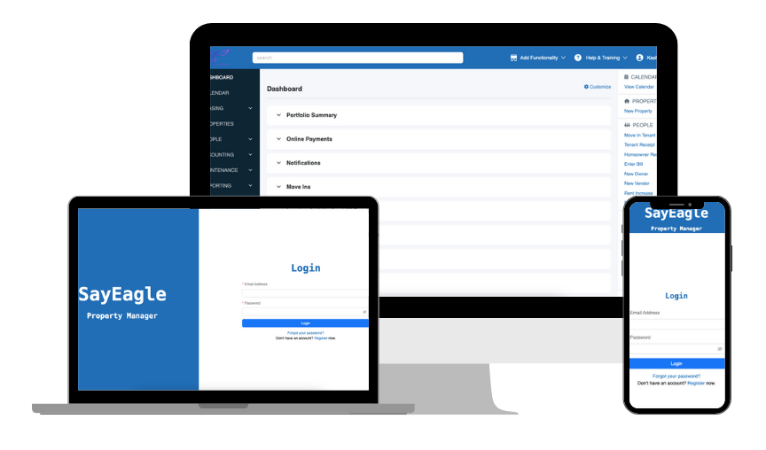
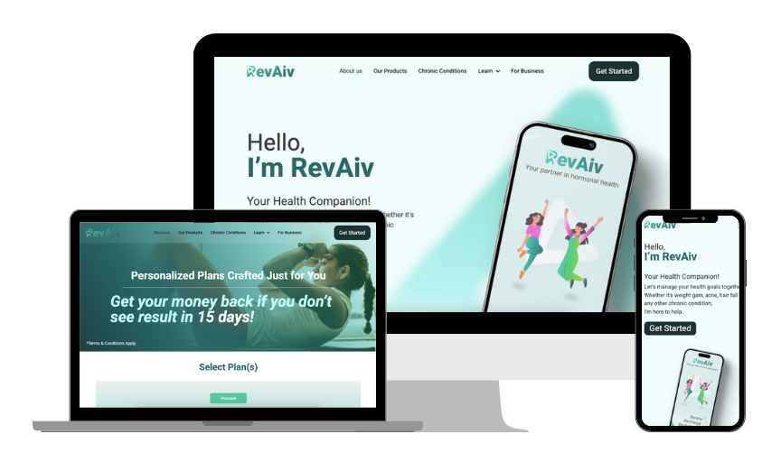

  
  <h1>👋 Hi, I'm Kashif Ali</h1>
  <h3>🚀 Full Stack & AI Engineer | React • Next.js • React Native • SaaS</h3>

  

    
    
    
    
  

---

## 🧑‍💻 About Me
- 💼 **5+ years** of experience delivering production-ready web & mobile apps.
- 🧠 Building **AI-powered products** (chatbots, voice agents, LLM workflows).
- 🏗️ Strong in **system design, clean architecture, and scalable SaaS engineering**.
- 🤝 Team Lead mindset: mentoring developers, code reviews, and shipping with quality.

---

## ⚒️ Tech Stack

  

- **Frontend:** React.js, Next.js, Vue.js, Nuxt.js, TypeScript, Tailwind CSS  
- **Mobile:** React Native (iOS & Android)  
- **Backend:** Node.js, Express.js, REST APIs  
- **Databases:** MongoDB, Firebase, SQL/MySQL  
- **AI & LLM:** OpenAI, Gemini, Prompt Engineering  
- **Dev Workflow:** CI/CD, GitHub collaboration, performance optimization

---

## 💼 Work Experience

### 🏢 Appvertices — *Full Stack Developer (Team Lead)*
📍 Karachi, Pakistan | 🗓️ **July 2025 – Present**
- Leading full-stack web/mobile delivery with React.js, Next.js, React Native, and Node.js.
- Architecting REST APIs and database systems across MongoDB, Firebase, and SQL.
- Shipping apps to **Apple App Store** and **Google Play Store**.
- Integrating AI chatbots and voice agents with OpenAI/Gemini.

### 🤖 Mercor Intelligence — *Web Development & Design Expert*
📍 Remote (Contract) | 🗓️ **March 2025 – June 2025**
- Trained and fine-tuned LLMs for front-end and full-stack development workflows.
- Improved code-generation quality for React, Vue, Next.js, Tailwind, Node.js, and TypeScript.
- Built reference implementations and evaluation pipelines with AI researchers.

### 🌐 Sohomax (Forsit) — *Frontend Developer*
📍 South Korea · Remote | 🗓️ **October 2023 – January 2025**
- Built Compass features using Vue/Nuxt for marketplaces like Amazon, Qoo10, Walmart, Shopify.
- Developed responsive UI components with React, react-query, and Tailwind CSS.
- Contributed to integrations and scraping workflows with Node.js + Puppeteer.

### 🏠 SayEagle — *Full Stack Developer*
📍 Karachi, Pakistan | 🗓️ **January 2023 – November 2023**
- Built role-based property management platform for managers, admins, tenants, and vendors.
- Delivered React frontend and backend services with Node.js + Firebase Functions.
- Managed real-time data with Firestore and secure authentication.

### 📊 Futurealiti (Appsnation) — *Full Stack Developer*
📍 Karachi, Pakistan | 🗓️ **April 2021 – December 2022**
- Built task management and employee monitoring solutions.
- Contributed to CNBC front-end development and scalable architecture.
- Enhanced performance and responsive UX across products.

---

## 🚀 Featured Projects

<table>
  <tr>
    <td width="50%">
      <h3>🧳 Easy Travel Planner</h3>
      
      
AI-powered trip planning app for budget-friendly stays and smart itinerary insights.

      
<strong>Stack:</strong> React, Gemini API, Firebase, Tailwind, Shadcn UI, Magic UI

      <a href="https://easy-travel-planner.vercel.app/">🔗 Live</a> •
      <a href="https://github.com/Kashifalirajper/easy-travel-planner">💻 Source</a>
    </td>
    <td width="50%">
      <h3>🏢 SayEagle</h3>
      
      
Property management platform with role-based portals and real-time operations.

      
<strong>Stack:</strong> React, Node.js, Firebase, Firestore, Tailwind CSS

      <a href="https://sayeagle.web.app/">🔗 Live</a>
    </td>
  </tr>
  <tr>
    <td width="50%">
      <h3>📰 CNBC Contribution</h3>
      
      
Contributed to responsive front-end improvements for CNBC web experiences.

      
<strong>Stack:</strong> React, JavaScript, Redux, REST APIs, Tailwind

      <a href="https://www.cnbc.com">🔗 Website</a>
    </td>
    <td width="50%">
      <h3>💚 Revaiv</h3>
      
      
Health management app focused on hormonal symptom tracking and guidance.

      
<strong>Stack:</strong> React.js, Firebase, Google Auth, Tailwind, Vercel

      <a href="https://revaiv.vercel.app/">🔗 Live</a>
    </td>
  </tr>
</table>

---

## 🎓 Education & Certifications
- 🎓 **BS Computer Science** — Sindh Madressatul Islam University *(2017–2021)*
- 🏅 **Frontend Developer (React)** — HackerRank *(2024)*
- 🏅 **JavaScript (Intermediate)** — HackerRank *(2023)*

---

## 🏢 Companies & Platforms I've Worked With

  
  
  
  
  

---

## 📫 Let’s Connect
- ✉️ **Email:** [kashifrajperali@gmail.com](mailto:kashifrajperali@gmail.com)
- 💼 **LinkedIn:** [linkedin.com/in/kashifalirajper](https://www.linkedin.com/in/kashifalirajper/)
- 🌐 **Portfolio:** [kashifalirajper.vercel.app](https://kashifalirajper.vercel.app/)
- 🧑‍💻 **GitHub:** [github.com/kashifalirajper](https://github.com/kashifalirajper)

---

  <h3>✨ Open to Full Stack, Frontend, and AI-integrated product roles ✨</h3>

